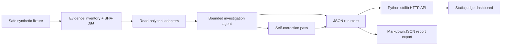

# EvilTrace Architecture

## Components

- **Evidence inventory**: hashes and catalogs fixture artifacts.
- **Read-only tools**: deterministic checks for suspicious authentication, impossible travel, command execution, persistence, and exfiltration signals.
- **Investigation agent**: performs a bounded sequence of checks, records rationale, and drafts findings.
- **Self-correction**: revisits weak claims and downgrades confidence when evidence is insufficient.
- **Dashboard**: displays timeline, evidence, findings, and corrections.

## Design choices

- Python standard library HTTP server keeps the demo dependency-free.
- Static frontend avoids build tooling and paid hosting assumptions.
- Core evidence decisions are deterministic; optional LLM expansion can be added later without changing the trust boundary.
